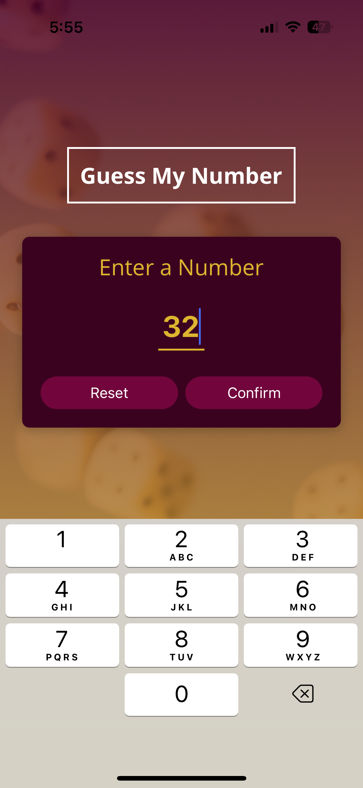
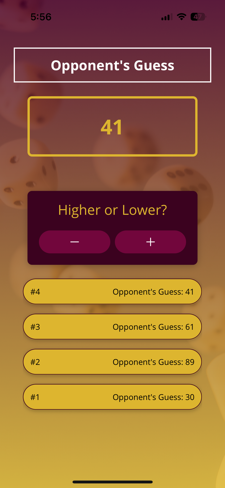

# 🎯 Guess My Number App

사용자가 생각한 숫자를 앱이 추측하며 맞히는 게임 앱입니다.  
앱이 숫자를 제시하면 사용자가 "UP" 또는 "DOWN"을 눌러 범위를 좁히고,  
앱은 그에 따라 추측을 계속 갱신해 나갑니다.

---

## 📱 스크린샷

| 시작 화면                                      | 게임 진행 화면                               | 게임 종료 화면                                       |
| ---------------------------------------------- | -------------------------------------------- | ---------------------------------------------------- |
|  |  |  |

---

## 🔧 주요 기능

- 사용자가 생각한 숫자를 앱이 추측하는 게임 로직
- React Native 컴포넌트 및 상태 관리(`useState`, `useEffect`) 학습
- 사용자 피드백에 따라 앱이 추측 범위를 동적으로 조절
- 게임 종료 시 시도 횟수 및 결과 표시

---

## 📂 폴더 구조

```bash
rn-guess-my-number-app/
              ├── assets/ # 이미지 및 기타 정적 파일
              ├── components/ # 재사용 가능한 UI 컴포넌트
              │ └── game/
              │ └── ui/
              ├── constants/ # 색상 등 상수 관리
              ├── screens/ # 화면 단위 컴포넌트
              │ ├── StartGameScreen.js
              │ ├── GameScreen.js
              │ └── GameOverScreen.js
              ├── App.js # 진입점
              └── ...
```

---

## 🚀 실행 방법

```bash
# 패키지 설치
npm install

# Expo 시작
npx expo start
```

iOS 기기는 Expo Go 앱을 통해 QR코드를 스캔하면 바로 확인 가능합니다.
