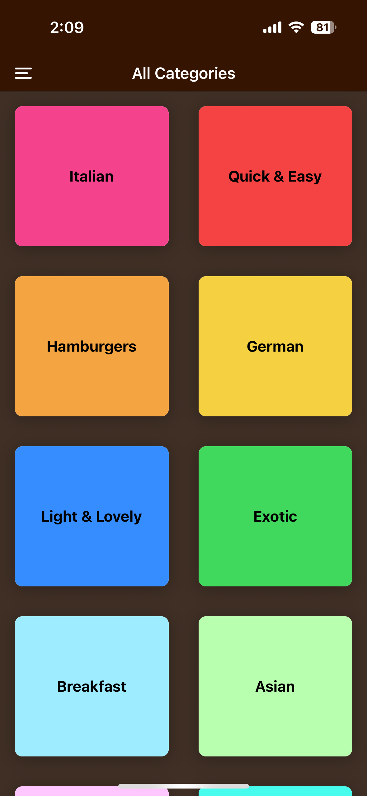
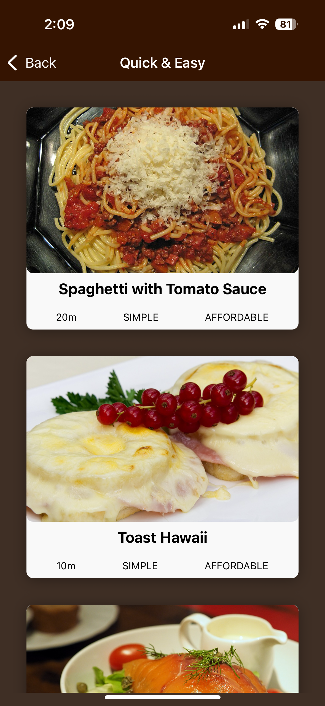
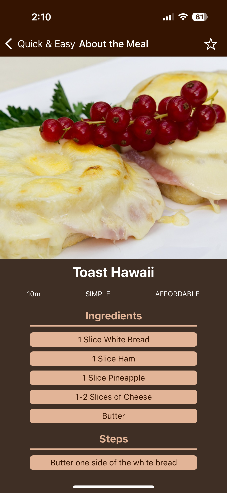
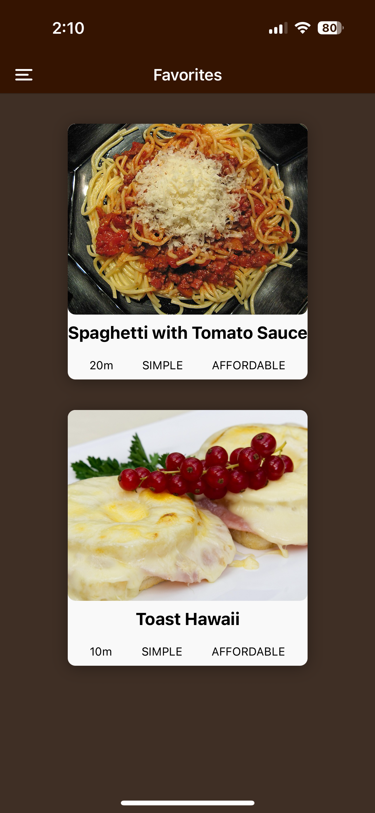

# 🍽️ Meals Info App

다양한 식사 카테고리와 해당 식사의 정보를 확인할 수 있는 앱입니다.

---

## 📱 스크린샷

| 카테고리 목록                                            | 식사 리스트                                         | 식사 상세 정보                                        | 식사 즐겨찾기 리스트                                    |
| -------------------------------------------------------- | --------------------------------------------------- | ----------------------------------------------------- | ------------------------------------------------------- |
|  |  |  |  |

---

## ✨ 주요 기능

- 식사 **카테고리 목록**을 리스트로 확인
- 카테고리 선택 시, 해당 **식사 리스트** 노출
- 식사 항목 클릭 시 **상세 정보 페이지**로 이동
- 각 식사는 이름, 시간, 난이도, 재료, 조리 순서 등의 정보를 포함
- **Drawer Navigation**과 **Stack Navigation**을 합치해 유연한 네비가이션 구현
- **화면별 동적 태일 설정** 기능 구현

---

## 🧭 Navigation 구성

이 앱에서는 `@react-navigation` 패키지를 이용해 다양한 네비가이션 형식을 구성하여 사용자가 편하게 동작할 수 있도록 하였습니다.

- Stack Navigator 을 기본으로 사용
- Drawer Navigator에서 카테고리와 프로일 사이드로 화면 전환
- `options={{ title: "문제 이름" }}`과 `navigation.setOptions` 구조를 이용하여 화면 제목 동적 설정 구현

---

## ⚡️ 사용 패키지

- `@react-navigation/native`
- `@react-navigation/native-stack`
- `@react-navigation/drawer`
- `react-native-screens`
- `react-native-safe-area-context`
- `react-native-gesture-handler`

---

## 📂 폴더 구조

```bash
rn-meals-info-app/
      ├── assets/               # 폰트 및 이미지
      ├── components/           # 공통 UI 컴포넌트
      ├── data/                 # 더미 데이터
      ├── models/               # 데이터 모델 정의
      ├── navigation/           # 네비게이터 설정
      ├── screens/              # 각 화면 컴포넌트
      ├── constants/            # 색상 등 스타일 상수
      ├── App.js                # 앱 진입점
```

---

## 🚀 실행 방법

```bash
# 패키지 설치
npm install

# Expo 시작
npx expo start
```

iOS 기기는 Expo Go 앱을 통해 QR코드를 스캔하면 바로 확인 가능합니다.
