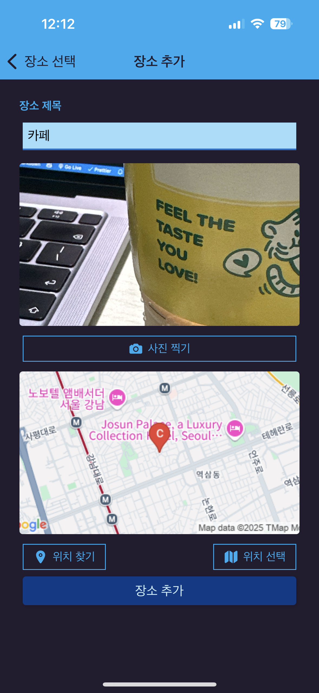
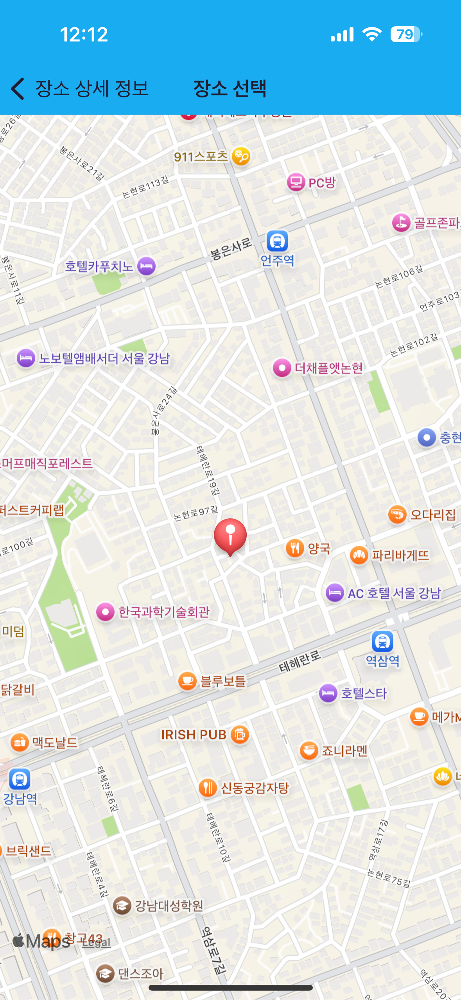

# rn-my-fav-spots-app

나만의 좋아하는 장소를 저장하고 관리할 수 있는 React Native 앱입니다.  
Expo와 SQLite를 사용해 장소 데이터를 로컬 DB에 저장하며,  
`react-native-maps`를 활용해 지도 기반 위치 선택 및 표시 기능을 구현했습니다.

---

## 주요 기능

- **장소 추가 및 저장**
  - 제목, 사진, 주소, 위도/경도 정보를 입력해 장소 등록
  - 사진 촬영 및 갤러리에서 이미지 선택 가능 (Expo ImagePicker 활용)
- **지도 기반 위치 선택**
  - `react-native-maps`의 지도 화면에서 원하는 위치를 눌러 장소 위치 지정
  - 선택한 위치에 마커 표시
- **장소 목록 및 상세 조회**
  - 저장된 장소들을 리스트로 확인 가능
  - 각 장소의 상세 정보와 위치를 지도에 마커로 표시
- **사용자 현재 위치 표시**
  - 권한 허용 시 현재 사용자의 위치를 지도에 표시하여 주변 장소와 거리 확인 가능
- **SQLite 연동**
  - `expo-sqlite`를 이용해 로컬 데이터베이스에 장소 정보를 영속적으로 저장
- **UUID 활용**
  - 장소마다 고유한 UUID를 생성해 안정적인 식별자 관리

---

## 기술 스택

- React Native (Expo Managed Workflow)
- Expo SQLite (`expo-sqlite`)
- React Navigation
- UUID (`uuid`)
- Expo ImagePicker
- React Native Maps (`react-native-maps`)

---

## 설치 및 실행 방법

1. 저장소 클론

```bash
git clone https://github.com/zooyaho/react-native-practice-projects.git
cd rn-auth-demo-app
```

2. 의존성 설치

```bash
npm install
# 또는
yarn install
```

3. Expo 시작

```bash
npx expo start
```

4. Expo Go 앱이나 시뮬레이터로 실행

---

## 프로젝트 구조

```
/assets          # 이미지 및 리소스
/components      # 재사용 컴포넌트 (IconButton 등)
/navigation      # React Navigation 설정
/screens         # 화면 컴포넌트 (Main, AddPlace, PlaceDetails, Map 등)
/utils           # DB 및 유틸 함수
/App.js          # 앱 진입점
```

---

## 주요 코드 설명

- **SQLite DB 모듈**  
  `utils/db.js` 내 `initPlacesDB`, `insertPlaceDB`, `fetchPlaceByIdDB` 함수로 로컬 DB 초기화, 데이터 삽입, 조회 기능 구현

- **UUID 생성**  
  `uuid` 라이브러리 사용해 장소 고유 ID 자동 생성

- **React Navigation 설정**  
  `navigation` 폴더에서 스택 네비게이터 설정, 화면 간 이동 처리

- **지도 컴포넌트**  
  `react-native-maps` 활용해 장소 위치 마커 표시 및 사용자 현재 위치 표시 기능 구현

- **장소 추가 화면**  
  사진 촬영(Expo ImagePicker), 위치 선택(지도 상 롱프레스) 등 UI와 로직 구성

- **장소 상세 화면**  
  장소 정보 표시와 함께 지도에서 해당 위치 마커 표시

- **공통 컴포넌트**  
  아이콘 버튼, 입력 폼 등 재사용 가능한 UI 컴포넌트 모음

---

## 스크린샷

| 메인 화면                                 | 장소 추가 화면                                 | 장소 상세 화면                                     | 지도 위치 선택                    |
| ----------------------------------------- | ---------------------------------------------- | -------------------------------------------------- | --------------------------------- |
|  |  |  |  |

---

## 참고 사항

- Expo 환경에서 `.env` 환경변수 사용 시 `react-native-dotenv` 설정 필요
