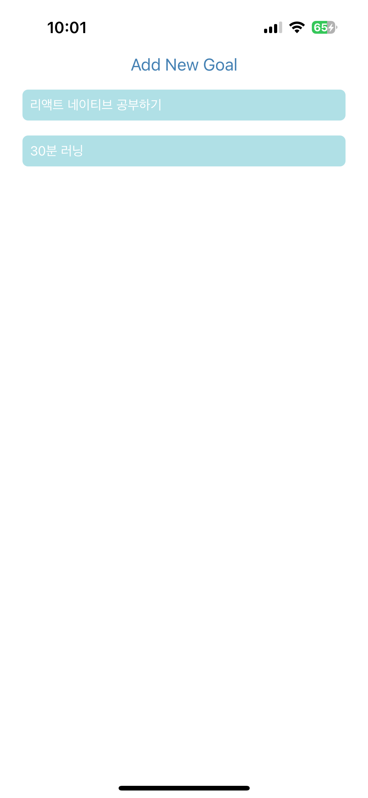

# 🎯 React Native 목표 작성 앱

React Native 학습을 위해 제작한 간단한 목표 작성 앱입니다.  
사용자는 새로운 목표를 입력하고 추가하거나, 기존 목표를 삭제할 수 있습니다.

## 📱 주요 기능

- **목표 추가**

  - 상단 `Add New Goal` 버튼 클릭 시 모달이 열립니다.
  - 텍스트 입력 후 `Add Goal` 버튼을 누르면 목표가 리스트에 추가됩니다.

- **목표 삭제**
  - 리스트에 있는 항목을 클릭하면 해당 목표가 삭제됩니다.

## 🧩 사용된 기술

- React Native
- Expo (모바일 실행용)
- `FlatList`를 사용한 리스트 렌더링
- `Modal`을 통한 목표 입력 UI

## 🖼️ 화면 예시

| 메인 화면                                | 목표 입력 모달                            |
| ---------------------------------------- | ----------------------------------------- |
|  |  |
