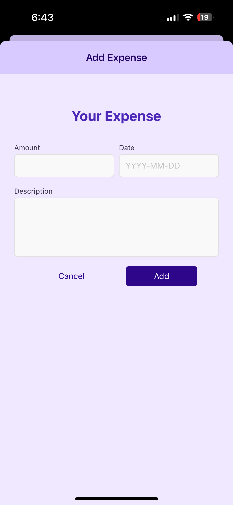
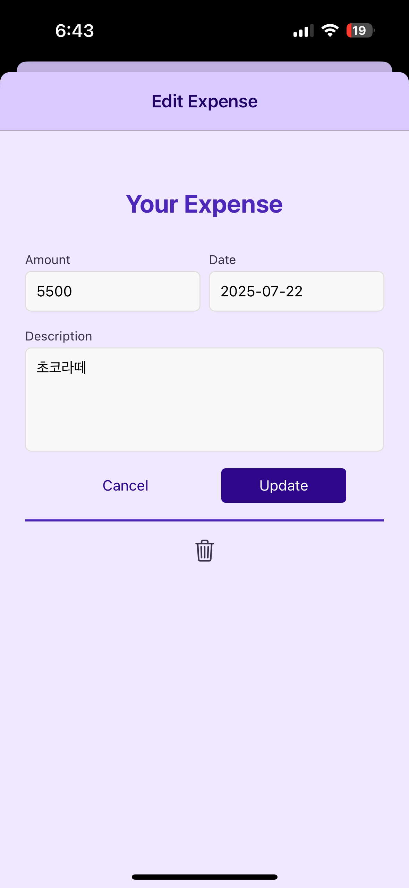

# 💲 rn-my-wallet-app

React Native 기반으로 만든 간단한 가계부 앱 프로젝트입니다.  
사용자가 지출 내역을 추가, 수정, 삭제하고, 최근 지출 내역을 확인할 수 있는 기능을 포함하고 있습니다.

---

## 📱 스크린샷

| 모든 지출 내역                                        | 최근 지출 내역                                          | 지출 내역 추가                                       | 지출 내역 수정                                        |
| ----------------------------------------------------- | ------------------------------------------------------- | ---------------------------------------------------- | ----------------------------------------------------- |
|  |  |  |  |

---

## ✨ 주요 기능

- 지출 내역 추가, 수정, 삭제
- 최근 7일간 지출 내역 필터링 및 조회
- 입력 폼 유효성 검사 (금액, 날짜, 설명)
- Firebase Realtime Database 연동을 통한 데이터 저장 및 불러오기
- Context API와 useReducer를 활용한 상태 관리

---

## 🛠️ 기술 스택

- React Native
- Firebase Realtime Database
- Axios
- React Navigation
- Context API & useReducer

---

## 📂 폴더 구조

```
/src
  /components      # UI 컴포넌트
  /screens         # 화면별 컴포넌트
  /context         # 상태 관리(Context API)
  /utils           # 유틸리티 함수
  /api             # Firebase API 함수
App.js             # 앱 진입점
```

---

## 🚀 환경설정 및 실행 방법

1. **의존성 설치**

   ```bash
   npm install
   # 또는
   yarn install
   ```

2. **Firebase 설정**

   - Firebase 프로젝트 생성 후 Realtime Database 활성화
   - Database 규칙을 개발용으로 아래와 같이 설정(배포 전에는 보안 강화 필요)
     ```json
     {
       "rules": {
         ".read": true,
         ".write": true
       }
     }
     ```
   - `src/api/firebase.js` 또는 환경 변수에 본인의 Firebase Database URL 입력

3. **앱 실행**
   ```bash
   npx react-native run-ios   # iOS 시뮬레이터 실행
   npx react-native run-android   # Android 에뮬레이터 실행
   ```

---

## 주요 파일 설명

- `src/api/expenseApi.js` : Firebase와 통신하는 API 함수
- `src/context/ExpenseContext.js` : 지출 내역 전역 상태 관리
- `src/screens/ManageExpense.js` : 지출 추가/수정 화면
- `src/screens/ExpensesOverview.js` : 지출 목록 화면

---
